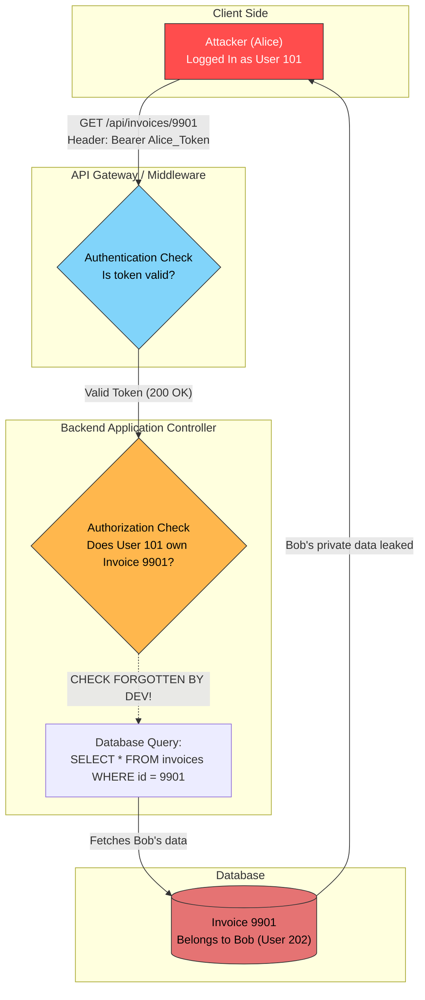
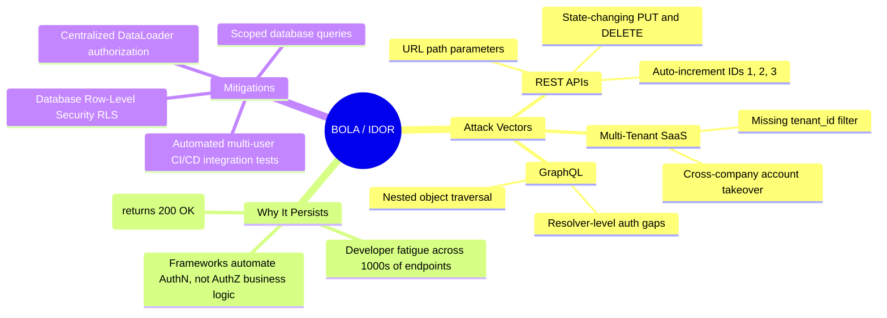

# Day 2: Broken Object-Level Authorization (BOLA / IDOR)

> [!abstract] Core Definition
> **BOLA** (Broken Object-Level Authorization), historically called **IDOR** (Insecure Direct Object Reference), is an access control flaw where an API accepts an object identifier directly from user input without verifying whether the requesting user has permission to access or modify that specific object.
> 
> It currently holds the **#1 spot on the OWASP API Security Top 10**.

---

## 1. Visual Flow: AuthN vs. AuthZ

The flaw arises from confusing **Authentication** (*Who are you?*) with **Authorization** (*What can you touch?*).



---

## 2. Concept Mindmap



---

## 3. The Code Flaw: REST API Pattern

Here is the exact implementation mistake in backend controller logic:

```python
# VULNERABLE CONTROLLER (Python/Flask)
@app.route("/api/documents/<doc_id>", methods=["GET"])
@require_auth  # Step 1: Validates the user is logged in
def get_document(doc_id):
    # FLAW: Direct lookup without validating ownership against the session!
    document = db.query("SELECT * FROM documents WHERE id = :id", id=doc_id)
    
    if not document:
        return {"error": "Not found"}, 404
        
    return document.to_json()
```

> [!danger] The Flaw
> The `@require_auth` decorator proves the client has an account. However, the database query blindly trusts the `doc_id` parameter without verifying that `document.owner_id == current_user.id`.

### The Secure Remediation
```python
# SECURE CONTROLLER
@app.route("/api/documents/<doc_id>", methods=["GET"])
@require_auth
def get_document(doc_id):
    current_user_id = session["user_id"]

    # SECURE: Bind object ID to the authenticated user ID in the query itself
    document = db.query(
        "SELECT * FROM documents WHERE id = :id AND owner_id = :uid",
        id=doc_id,
        uid=current_user_id
    )

    if not document:
        return {"error": "Document not found or access denied"}, 404

    return document.to_json()
```

---

## 4. BOLA in Modern Architectures

### A. Multi-Tenant SaaS Dashboards (B2B)
In B2B platforms (e.g., Shopify, Jira, HR software), data belongs to an **Organization/Tenant**, not just a single person. 

```
Company A (Tenant 100)           Company B (Tenant 200)
├── User: Alice (Victim)         └── User: Eve (Attacker)
└── Order: #8801                 └── Order: #8802
```

* **The Attack:** Attacker Eve views her own order (`/api/orders/8802`), then alters the parameter to view Company A's order (`/api/orders/8801`).
* **The Vulnerability:** The backend queries `WHERE id = 8801` instead of `WHERE id = 8801 AND tenant_id = 200`.
* **The Impact:** Cross-tenant corporate intelligence leakage, customer list theft, and bulk order alterations.

### B. GraphQL APIs (Graph Traversal Exploits)
In GraphQL, authorization logic is often placed at the top-level query resolver, leaving child field resolvers unprotected.

```graphql
# GraphQL Schema
type Query {
  invoice(id: ID!): Invoice        # Top-level query (Protected)
  user(id: ID!): User              # Public profile query (Public)
}

type User {
  id: ID!
  name: String
  invoices: [Invoice]              # Child field resolver (UNPROTECTED)
}
```

```graphql
# Attacker's Exploit Query (Graph Traversal)
query {
  user(id: "victim_bob") {
    name
    # Top-level check is bypassed by pivoting through public user data:
    invoices {
      id
      amount
      billingAddress
    }
  }
}
```

> [!warning] GraphQL Resolver Blindness
> The developer secured the root `query.invoice()` resolver. However, the nested `user.invoices` resolver blindly executes `SELECT * FROM invoices WHERE owner_id = parent.id`, allowing anyone to traverse into another user's private records.

> [!note] The Core Attack Concept (GraphQL BOLA)
> 1. **Alice logs in legitimately:** She has a valid session token (she doesn't forge or hack authentication).
> 2. **Alice finds Bob's ID:** Bob's username or ID is public (from a forum post, profile URL, or auto-incrementing number).
> 3. **The Exploit:** Alice crafts a single GraphQL query: `user(id: "bob") { invoices { amount } }`.
> 4. **The Flaw:** The GraphQL engine resolves Bob's public profile, then automatically resolves Bob's invoices. Because the developer never wrote a check inside `invoices` verifying that `logged_in_user == requested_user`, the server hands Bob's private records to Alice.

---

## 5. The Common Misconception: "UUIDs Fix BOLA"

Many developers believe replacing auto-incrementing integers (`/invoices/1042`) with random UUIDs (`/invoices/9b1deb4d-3b7d-4bad-9bdd-2b0d7b3dcb6d`) solves BOLA.

| Approach                       | What It Does                      | Why It Fails as a Security Control                                                                                                                                     |
| ------------------------------ | --------------------------------- | ---------------------------------------------------------------------------------------------------------------------------------------------------------------------- |
| **Sequential IDs** (`1, 2, 3`) | Predictable database indexes.     | Attacker runs a 5-line script to enumerate every record in minutes.                                                                                                    |
| **UUIDs** (`v4`)               | Prevents brute-force ID guessing. | **Security through obscurity.** If the UUID is leaked (via referrers, logs, chats, or APIs), the endpoint still hands over data because the ownership check is absent. |

---

## 6. Real-World Attack Surface Matrix

| Target Scenario       | Attack Vector                      | Common HTTP Method       | Impact                                                       |
| --------------------- | ---------------------------------- | ------------------------ | ------------------------------------------------------------ |
| **REST Read**         | Direct ID manipulation in URL path | `GET`                    | Bulk personal and financial data exfiltration.               |
| **REST Write**        | Overwriting other users' resources | `PUT`, `PATCH`, `DELETE` | Account takeovers, data deletion, privilege escalation.      |
| **Multi-Tenant SaaS** | Missing `tenant_id` validation     | `GET`, `POST`            | Cross-company tenant data exposure and account takeover.     |
| **GraphQL APIs**      | Nested node graph traversal        | `POST` (GraphQL body)    | Bypasses top-level authorization guards via child resolvers. |

---

## 7. Defense-in-Depth Mitigation Standards

To eliminate BOLA, mature engineering teams do not rely solely on developers remembering to write manual checks on every route:

### 1. Database Row-Level Security (RLS)
Configure authorization directly at the database engine level (e.g., PostgreSQL). The database enforces isolation regardless of application code flaws:
```sql
-- PostgreSQL Row Level Security Example
ALTER TABLE invoices ENABLE ROW LEVEL SECURITY;

CREATE POLICY tenant_isolation_policy ON invoices
    FOR ALL
    USING (tenant_id = current_setting('app.current_tenant_id')::uuid);
```

### 2. Centralized Data Access Layers (DataLoader Pattern)
In GraphQL and microservices, ensure all object access passes through a centralized abstraction layer that validates user permissions before executing queries:
```python
def get_invoice_by_id(invoice_id, requesting_user):
    invoice = db.find_by_id(invoice_id)
    if not invoice or invoice.tenant_id != requesting_user.tenant_id:
        raise PermissionDeniedError("Access Denied")
    return invoice
```

### 3. Automated Multi-User Integration Tests
Include automated regression suites in CI/CD pipelines that test every endpoint with two separate accounts:
1. `User_A` creates an entity.
2. `User_B` attempts to read, modify, and delete `User_A`'s entity.
3. The build fails if the server returns any status code other than `403 Forbidden` or `404 Not Found`.
---

## 8. Real-World Prevalence & Exploit Success Rates

> [!abstract] Key Industry Takeaway
> BOLA accounts for over **50% of all high-severity findings** in enterprise API security reports (Salt Security, Noname/Akamai, HackerOne). Because requests look identical to legitimate traffic, automated WAFs and static analyzers almost never catch them without deep business-logic modeling.

### A. Exploit Success Matrix

| Attack Vector                   | Target Scenario                               | Prevalence Across APIs | Exploit Success Rate (When Present) | Primary Detection Blocker                                  |
| ------------------------------- | --------------------------------------------- | ---------------------- | ----------------------------------- | ---------------------------------------------------------- |
| **Sequential REST Enumeration** | Integer IDs in URLs (`/orders/101`)           | **High (~35%)**        | **~95%**                            | Lacks auth checks; easily scripted via simple loops.       |
| **Multi-Tenant SaaS Leaks**     | Cross-company endpoints missing `tenant_id`   | **Moderate (~25%)**    | **~85% - 90%**                      | Attacker has a valid token; passes edge authentication.    |
| **GraphQL Nested Traversal**    | Deep object chains & field resolvers          | **Moderate (~20%)**    | **~75% - 85%**                      | Root queries are guarded, but child resolvers run blind.   |
| **State-Changing BOLA**         | Modifying/deleting objects via `PUT`/`DELETE` | **Low-Mod (~15%)**     | **~60% - 70%**                      | Developers test mutations slightly more than read queries. |
| **UUID-Guarded Endpoints**      | Unprotected endpoints using random UUIDs      | **High (~40%)**        | **~25% - 35%**                      | Requires finding a separate ID leak (logs, URLs, chats).   |

---

### B. Vector Deep Dive & Operational Drivers

> [!danger] Sequential REST Enumeration (~95% Success)
> * **Mechanism:** Incrementing integer IDs (`/api/invoices/1042` $\rightarrow$ `/1043`).
> * **Why It Succeeds:** If the endpoint lacks an ownership check, automated enumeration tools (Burp Intruder, Python scripts) can pull an entire database with zero cryptographic resistance.
> * **Detection:** Easily flagged by anomaly detection if high-volume sequential hits come from a single user session or IP.

> [!danger] Multi-Tenant SaaS Boundary Leaks (~85% - 90% Success)
> * **Mechanism:** A legitimate user in Company A inputs object IDs owned by Company B.
> * **Why It Succeeds:** Developers often test inside a single sandbox tenant. Because the attacker’s token is valid, it sails through the API gateway.
> * **Impact:** Wholesale customer list exfiltration, financial record leakage, and regulatory fines (GDPR, HIPAA).

> [!danger] GraphQL Nested Traversal (~75% - 85% Success)
> * **Mechanism:** Chaining from a public node into a private child field (`user(id: "bob") { invoices { amount } }`).
> * **Why It Succeeds:** The GraphQL execution engine calls child resolvers independently. The top-level query is secured, but the child resolver assumes permissions were already verified upstream.

> [!warning] State-Changing BOLA (`PUT`, `PATCH`, `DELETE`) (~60% - 70% Success)
> * **Mechanism:** Tampering with another user's profile, role, or asset by passing their resource ID in a destructive request.
> * **Why It Succeeds:** Secondary or utility endpoints (e.g., "archive project" or "remove member") frequently skip the rigorous ownership checks applied to the primary update flow.

> [!info] UUID-Protected Resources (~25% - 35% Success)
> * **Mechanism:** Endpoints lack ownership checks, but IDs are 128-bit random strings (`UUIDv4`).
> * **Why It Fails/Succeeds:** UUIDs cannot be brute-forced (search space is $2^{122}$). Exploitation only works if the victim's UUID is leaked via secondary channels:
>   - Public user profiles, forum posts, or shared web links
>   - Browser history, referer headers, or client logs
>   - Shared team collaboration boards or public API lists

---

## 9. Why BOLA Bypasses Modern Defenses (WAF Invisibility)

```mermaid
flowchart TD
    A["Legitimate Login Token (AuthN)"] --> B["Legitimate HTTP Request"]
    B --> C{"Web Application Firewall (WAF)"}
    
    C -->|"No SQL syntax<br/>No script tags<br/>Looks 100% normal"| D["Passes WAF Undetected"]
    
    D --> E["Backend API Controller"]
    E -->|"Executes lookup<br/>Returns 200 OK + JSON"| F["Data Breach Occurs"]
    
    style A fill:#81d4fa,stroke:#333,color:#000
    style C fill:#ffb74d,stroke:#333,color:#000
    style D fill:#a5d6a7,stroke:#333,color:#000
    style F fill:#ef9a9a,stroke:#333,color:#000