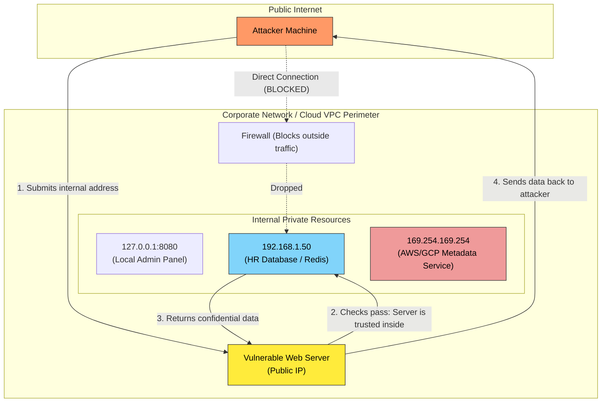
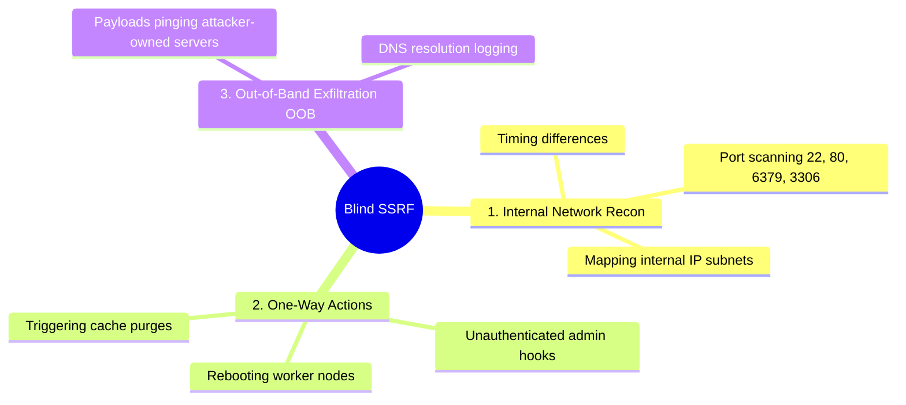

# Day 1: Server-Side Request Forgery (SSRF)

> [!abstract] Core Definition
> **Server-Side Request Forgery (SSRF)** is a web vulnerability where an attacker tricks a backend server into making HTTP requests to internal, private, or restricted destinations on the attacker's behalf. 
> 
> Because the server sits **inside** the corporate network/cloud perimeter, firewalls trust it. Attackers exploit this trust to access resources that are unreachable from the public internet.

---

## 1. Mental Model: The Office Receptionist

To understand why SSRF happens, imagine a high-security corporate headquarters:
* **The Attacker (Public):** Sits outside on the street. Armed guards and perimeter firewalls block them from entering.
* **The Backend Server (The Receptionist):** Sits inside the lobby with an all-access security badge to every room.
* **The "Fetcher" Feature:** The receptionist offers a service: *"Give me the name of a business across the street, and I will walk out, grab a flyer, and bring it back for you."*
* **The SSRF Exploit:** The attacker hands the receptionist a note that says: *"Fetch document from Room 402 (The Boss's Safe)."*
* **The Vulnerability:** The naive receptionist does not check if the address is inside or outside. They take their all-access badge, enter Room 402, pull out the payroll records, and hand them directly to the stranger outside.

---

## 2. Visual Architecture Flow



---

## 3. The Vulnerable Code Pattern

Here is the exact 3-line pattern that creates this vulnerability:

```python
# 1. Take a URL directly from user input
target_url = request.args.get("avatar_url")

# 2. Naively fetch whatever link was provided (The "Fetcher")
response = requests.get(target_url)

# 3. Hand the raw contents back to the user
return response.content
```

> [!danger] The Flaw
> The fetcher treats user input as trusted. It does not inspect whether the destination resolves to a public website or a private IP inside the internal network.

---

## 4. Attacker Evolution vs. Defenses

When developers add basic filters, attackers adapt. Here is how the cat-and-mouse game works:

### Round 1: IP Blacklists vs. Alternate IP Encodings
* **The Defense:** The developer writes `if "127.0.0.1" in url: block()`.
* **Attacker Bypass:** Computers accept multiple numerical formats for IP addresses:
  * **IPv6 Loopback:** `http://[::1]/`
  * **Decimal IP:** `http://2130706433/` (the 32-bit integer form of `127.0.0.1`)
  * **Hex / Octal:** `http://0177.0.0.1/`
  * **Shortcuts:** `http://0/` or `http://localhost/`

### Round 2: Domain Names vs. DNS Rebinding (Bait-and-Switch)
* **The Defense:** The developer looks up the IP of the domain name first. If it is private, they block it; if public, they fetch it.
* **Attacker Bypass (DNS Rebinding):**
  1. The attacker controls their own domain (`evil.com`) and custom DNS server.
  2. The attacker sets the **TTL (Time-To-Live)** of the DNS record to **0 seconds** (meaning: "never cache this number").
  3. **Check 1 (The Bait):** Server checks `evil.com`. Attacker's DNS returns `8.8.8.8` (safe, public). The security check passes.
  4. **Check 2 (The Switch):** Server actually runs `requests.get("evil.com")`. Because TTL was 0, it asks the DNS server a second time.
  5. Attacker's DNS server now responds with `127.0.0.1` or `169.254.169.254`. The request goes to the secret internal service.

### Round 3: Public Domains vs. HTTP Redirects (`302`)
* **The Defense:** The server only allows URLs pointing to verified public IP domains.
* **Attacker Bypass:** The attacker points the server to a real, public website they own (`https://attacker.com/image.png`).
  * The server checks the IP: completely public and legitimate.
  * The server connects to `attacker.com`.
  * The attacker's server immediately returns an **HTTP 302 Redirect** pointing to `http://192.168.1.50/passwords`.
  * Because HTTP libraries (Python `requests`, Axios, cURL) follow redirects by default, the server follows the detour straight into the internal network.

### Round 4: URL Parser Inconsistencies
* **Attacker Bypass:** Exploiting differences between how the security library and the HTTP fetcher parse URLs (e.g., using credentials syntax `http://safe.com@127.0.0.1`). If the checker reads the domain as `safe.com` while the fetcher connects to `127.0.0.1`, the validation fails silently.

---

## 5. Success Rates & Commonality in the Real World

| Technique                         | Prevalence    | Success Rate (Against Defenses)                 | Notes                                                                                                           |
| --------------------------------- | ------------- | ----------------------------------------------- | --------------------------------------------------------------------------------------------------------------- |
| **HTTP Redirects (`302`)**        | **Very High** | **~70% - 80%**                                  | Most popular libraries follow redirects by default unless explicitly disabled (`allow_redirects=False`).        |
| **Alternative IP / IPv6 Formats** | **High**      | **~40% - 50%**                                  | Defeats simple regex string checks. Completely fails if the server parses addresses with standard IP libraries. |
| **DNS Rebinding**                 | **Medium**    | **~60% - 75%** (Code checks) / **~0%** (IMDSv2) | Exploits the race condition between check and fetch. Stopped completely by IP socket pinning.                   |
| **Parser Confusion**              | **Low**       | **~20% - 30%**                                  | Highly dependent on specific combinations of programming languages and server frameworks.                       |

---

## 6. Blind SSRF: When the Server Doesn't Return Data

In regular SSRF, the server fetches data and displays it on the screen. In **Blind SSRF**, the server fetches the target, but **never shows the response** (e.g., it only shows `"Profile picture updated"` or a generic error).

Attackers still use Blind SSRF for three key purposes:



1. **Internal Port Scanning (Timing Attacks):**
   * Target closed port: Server responds in **10ms** (immediate TCP RST / connection refused).
   * Target open port: Server responds in **3000ms** (waits for handshake or times out).
   * By tracking response times, the attacker maps every open port across the company's internal network.
2. **Triggering Blind Internal Actions:**
   * Calling internal microservice endpoints that execute state-changing actions without authentication (e.g., `http://worker-queue:8080/jobs/flush`).
3. **Out-of-Band (OOB) Exfiltration:**
   * Tricking the server into sending sensitive parameters to a domain controlled by the attacker (`http://evil-logger.com/?data=...`).

---

## 7. The Production Mitigation Standard (Defense-in-Depth)

To completely eliminate SSRF, engineers do not rely on simple string blacklists. They apply defense-in-depth at both the application and network layers:

### Layer 1: Application-Level Pinning (Prevent DNS Rebinding & Redirects)
```python
import socket
import ipaddress
import requests

def secure_fetch(url, hostname):
    # 1. Resolve domain name to IP ONCE
    ip_str = socket.gethostbyname(hostname)
    ip = ipaddress.ip_address(ip_str)

    # 2. Check against ALL private/local/link-local ranges
    if ip.is_private or ip.is_loopback or ip.is_link_local or ip.is_reserved:
        raise SecurityError("Access to internal IP blocked.")

    # 3. Disable redirects & connect directly to the verified IP
    # Pass original hostname in Host header for virtual hosts
    headers = {"Host": hostname}
    return requests.get(f"https://{ip_str}/asset", headers=headers, allow_redirects=False)
```

### Layer 2: Cloud Hardening (IMDSv2)
* Ensure all cloud servers (AWS EC2 / ECS) enforce **IMDSv2**. 
* IMDSv2 requires an HTTP `PUT` request with a special header (`X-aws-ec2-metadata-token-ttl-seconds`) to get a session token before metadata can be accessed. Naive SSRF `GET` requests cannot steal cloud keys under IMDSv2.

### Layer 3: Network Isolation (Zero Trust Architecture)
* Place any service that accepts external URLs into a dedicated, isolated subnet/DMZ.
* Use firewall/security group egress rules that physically block outbound traffic to private subnets (`10.0.0.0/8`, `172.16.0.0/12`, `192.168.0.0/16`, and `169.254.169.254`).